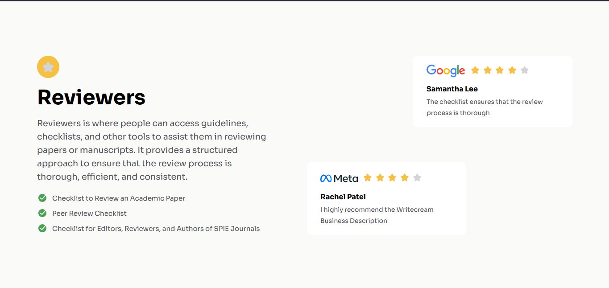
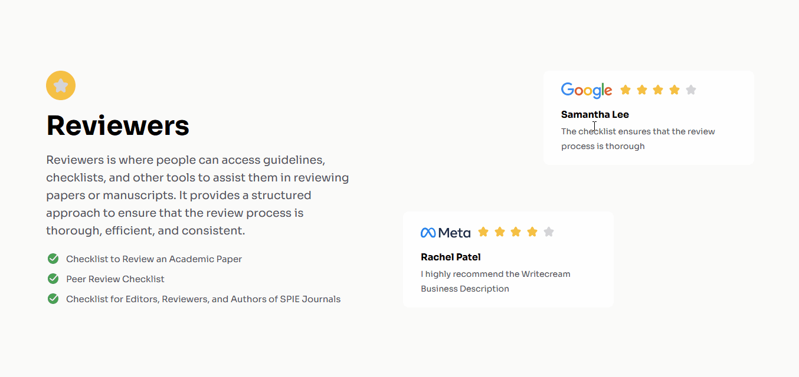
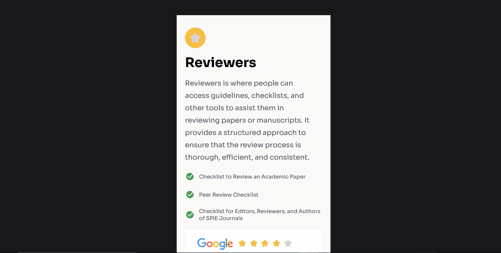

<h1 align="center">Dev Challanges Testimonial Page Master</h1>

  Projeto da Dev Challanges para praticar programação

  

 

## 🚀 Tecnologias

Esse projeto foi desenvolvido com as seguintes tecnologias:

- HTML CSS(Flex)
- Git Github

## 💻 Projeto

Serve para colocar em prática conhecimentos em Front-End. 

## Como ficou o projeto online

  

## 📱 Mobile

  

  
<a href="https://do-zero-ao-programador-contratado-projeto-dragon-qvqqfzms2.vercel.app/" target="_blank">Clique para</a> acessar o link</a>
  

## Conclusão

Desafio na responsivade e na hora de posicionar os elementos HTML.